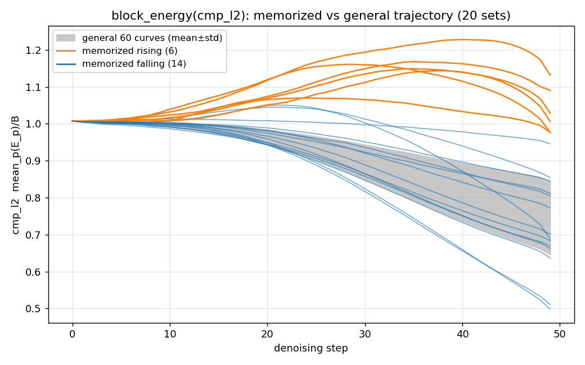

# block_energy 판별력 평가 (2026-08-22)

*General 곡선(회색 밴드) 대비 memorized 곡선 — 주황(상승 6)·파랑(하강 14) 혼재.
절대 level 차이는 미미하고, general은 전부 하강하는 반면 memo의 개형이 이분형*

## 판정: **REJECT**

- 3+1 개형 검증 11/20셋 분리 (비율 0.88~1.20x, 방향 역전 셋 존재) — 집단 통계(AUC 0.480~0.610)와 수렴
- 저주파(compact) 에너지 집중은 일반 이미지 형성 현상 — memorization 특이 신호 아님
- 경향: text 20/20 하강 vs memo 6 상승 + 14 하강 (기울기 기준 분리 10/20) — 방향성 신호는
  존재하나 검출기 기준 미달

## 측정

- vanilla SD1.4, CFG=7.5, NFE=50, seed=42, batch=5 — wen2024 10 vs COCO 10 + 기존 plot_num=20 (cmp_l2)
- 상세 수치·해석은 journal (2026-08-22 엔트리) 및 registry ② 참조
