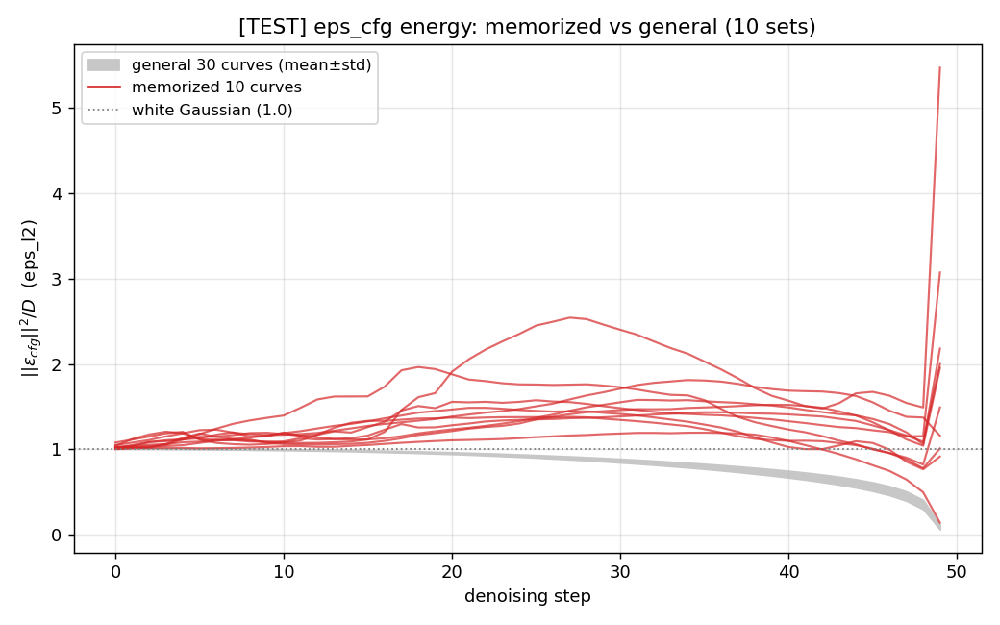

# eps_cfg energy 판별력 평가 (2026-08-22)

*General 30곡선(회색 밴드, mean±std) 대비 memorized 10곡선(적색) — 전곡선이 밴드 위에 위치.
점선 = white Gaussian 기준(1.0). general ≈ 0.84~0.87, memo ≈ 1.04~1.74*

## 판정: **GOOD**

- 10/10셋 분리 (step 비율 평균 99%, 비율 1.23~2.05x) — 완전 분리
- ②와의 대조: 같은 $\epsilon_{\text{cfg}}$ 신호의 spectral block 평균은 REJECT —
  판별 신호는 주파수 분포가 아닌 **총에너지**에 존재
- 한계: CFG=7.5 증폭 artifact 가능성 — 승격 전 `LOSS_CFG=1.0`($\epsilon_{\text{uc}}$) 대조 검증 필요

## 측정

- vanilla SD1.4, CFG=7.5, NFE=50, seed=42, batch=5 — coco 3 + membench 1 × 10셋
- 상세 수치·해석은 journal (2026-08-22 엔트리) 및 registry ③ 참조
