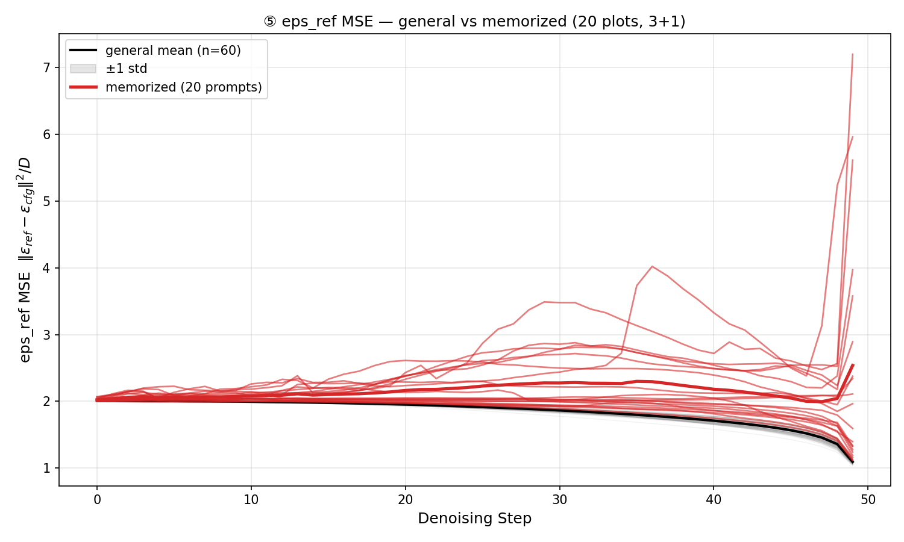

# ⑤ eps_ref MSE (‖ε_ref − ε_cfg(x_t,t)‖²/D) 판별력 평가 (2026-08-24)

## 판정: **GOOD**

- **20/20 비교셋 전부에서 memorized 곡선 평균이 general 위** (ratio 1.01~1.46x)
- 곡선-mean 집단 분리 **pairwise AUC = 0.9958** — text(n=60) 분산이 극히 작아
  (1.846±0.021) 격차 배수가 작아도 통계적 분리는 명확
- step 분리: 17/20 plot에서 94~100%, 예외 plot06(60%)·plot02(76%)·plot14(94%)는
  일부 구간 혼재 — 완전 예외(①의 plot12류)는 없음

## 데이터 (신규 측정 — 구현 후 1회 실행)

- 측정: `eps_trajectory.py --measure eps_ref_mse` (신규 구현 — ①의 ε_ref·③의 eps_l2_sig
  재사용, measure alias 경로로 저장·플롯 자동) · shell
  `shells/others/run_eps_trajectory_eps_ref_mse.sh`
- 위치: `results_eps_ref_mse_trajectory/ddim/CFG=7.5_NFE=50/seed=42/batch=5/plot_num=20`
- 모델: SD1.4, CFG=7.5, NFE=50, seed=42, batch=5 (seed 평균 곡선)
- 구성: plot당 coco_v2 3 (general) + memorized_prompts_membench 1 (memorized) × 20

## 곡선 개형

*General 60곡선(회색 밴드) 대비 memorized 20곡선(적색) — 밴드가 매우 타이트한 가운데
memo 곡선 전체가 위쪽에 위치, 격차는 초기 step에서 크고 후반 유지*

## plot별 수치 (발췌)

| plot | memo_mean | text_mean | ratio | step 분리 |
|---|---|---|---|---|
| 05 | 2.6533 | 1.8318 | **1.45x** | 100% |
| 17 | 2.6832 | 1.8375 | **1.46x** | 96% |
| 04 | 2.4202 | 1.8328 | 1.32x | 100% |
| (중간 다수) | ~1.9-2.0 | ~1.85 | 1.03~1.11x | 94-100% |
| 06 (최저) | 1.8724 | 1.8462 | 1.01x | 60% |

전체: memo 2.156±0.261 vs text 1.846±0.021

## 자동 해석

- **⑤는 memorization을 inference-time에서 감지할 수 있다** — 방향 20/20 일치 + AUC 0.996
- text baseline의 분산이 ①·④보다 훨씬 타이트(±1%) — 백그라운드가 안정적이라
  작은 격차(평균 1.17x)로도 분리가 성립하는 구조
- registry 비교 섹션의 이론 예측과 일치: 전개상 ③(‖ε_cfg‖²)와 기댓값 동치이나
  관측 스케일에 **ε_ref 상관항의 변동**이 포함됨 (값이 1 + ‖ε_cfg‖²/D ± 상관 형태)

## 한계

- 격차 폭이 작음 (1.17x 평균) — 백그라운드 std가 작아 AUC는 높지만, 프롬pt 다양성·
  다른 seed 세트에서 margin 재검증 필요 (④와 동일한 주의)
- 측정 비용: UNet 2회/step (analyze_single 경유 — ①와 동일, ε_s 재포워드 포함 경로에서
  계산만 추가됨. ⑤ 자체는 UNet 1회 신호지만 현재 구현은 ① 파이프라인 탑재)
- memo n=20 (membench 계열) · seed 평균 곡선

## 다음 액션

1. ③(eps_l2)와의 곡선 차이 직접 비교 — 기댓값 동치 예측의 실측 확인 (상관항 기여 분리)
2. Twd_gap 체계 최적화 이식 — loss만 ⑤로 교체 (grad의 ε_ref 상관항 = ③ 대비 차별점이
   완화에서 어떻게 작동하는지)
3. wen2024 교차검증
