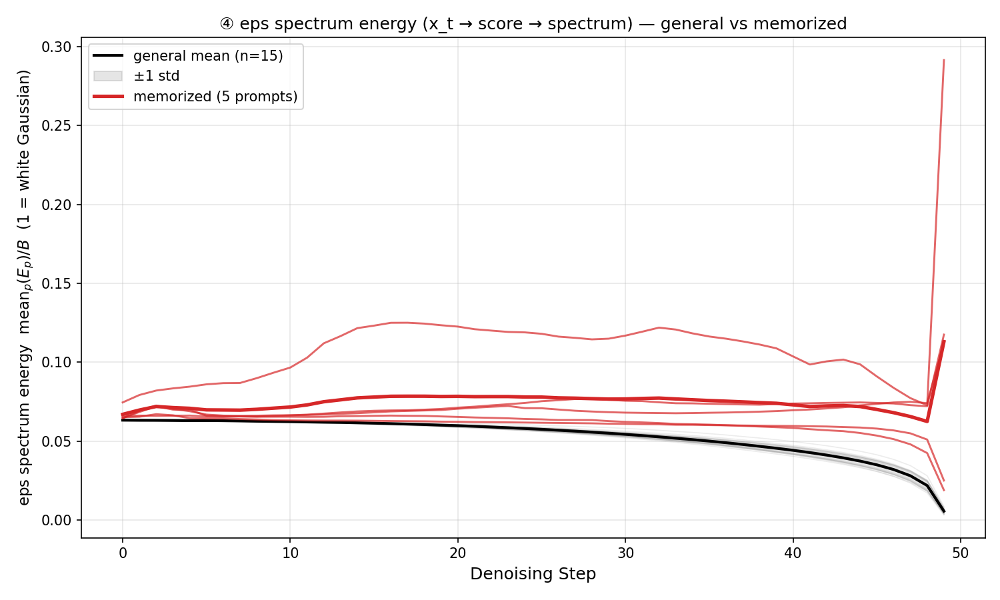

# ④ eps spectrum energy (x_t → score → spectrum) 판별력 평가 (2026-08-24)

## 판정: **GOOD**

- **5/5 비교셋에서 memorized 곡선이 general 3곡선의 최대치 위에 전 step 구간(100%) 분리**
- 곡선-mean 집단 분리 **pairwise AUC = 1.000** (memo n=5 > text n=15 전체)
- text 곡선군이 매우 타이트 (0.0529±0.0012) — baseline이 안정적

## 데이터 (기존 결과 재사용 — 재측정 없음)

- 측정: `eps_trajectory.py --proxy_trend --signal eps`
  (shell `shells/others/run_eps_spectrum_eps_energy.sh`, SIGNAL=eps, PROXY=all)
- 위치: `results_proxy_trend/signal=eps/ddim/CFG=7.5_NFE=50/seed=42/batch=5/plot_num=5`
- 모델: SD1.4, CFG=7.5, NFE=50, seed=42, batch=5 (seed 평균 곡선)
- 구성: plot당 coco_v2 3개 (general) + cvpr2025_memo 1개 (memorized) × 5 plot
- proxy: `mean_p(E_p)/B` (block_energy_raw (T,P) → mean/B, B=16,
  **1 = white Gaussian 기준** — optimize_xt_spectral spectral_l2_loss와 동일 scale)

## 곡선 개형

*General 15곡선(회색, mean±std 밴드) 대비 memorized 5곡선(적색) — 전 구간에서
밴드 위로 분리, 격차는 후반 step에서 유지*

## plot별 수치

| plot | memo_mean | text_mean | ratio | memo>text_max step 비율 |
|---|---|---|---|---|
| plot00 | 0.1095 | 0.0519 | **2.11x** | 100% |
| plot01 | 0.0701 | 0.0533 | 1.31x | 100% |
| plot02 | 0.0612 | 0.0528 | 1.16x | 100% |
| plot03 | 0.0725 | 0.0542 | 1.34x | 100% |
| plot04 | 0.0607 | 0.0525 | 1.16x | 100% |

## 자동 해석

- **④는 memorization을 inference-time에서 감지할 수 있다** — 5/5셋 100% 분리 + AUC 1.000
- ② (x_t 직접 spectral, REJECT)와 달리 **score(ε) 공간을 거치면 주파수 대역 energy가
  안정된 판별 신호가 됨** — ③ (ε raw energy, GOOD)의 판별력이 주파수 분해 후에도
  유지되며 baseline(text) 분산이 오히려 타이트해짐
- 방향: **값 클수록 memorized** (ε_cfg 스펙트럼이 white Gaussian에서 벗어나 대역 집중)

## 한계

- 격차 폭이 ①(5~20x)보다 작음 (1.16~2.11x) — 분리는 완전하나 임계값 설계 시
  margin이 작아 프롬pt 다양성 확대 시 재검증 필요
- memo 프롬pt n=5 (①은 n=20) · seed 평균 곡선 · webster 계열(cvpr2025_memo)
- 측정 비용: step당 UNet 1회 (ε_s 재추론 없음 — ①보다 가벼움, ③와 동일)

## 다음 액션

1. wen2024 계열 프롬pt로 교차 검증 (프롬pt 소스 일반화)
2. 저주파/고주파 밴드 갈래(PROXY=low/high) 비교 — 어떤 대역이 분리를 만드는지
   (②가 REJECT된 저주파 집중과의 관계 규명)
3. GOOD 판정 기반 완화 최적화 연결 검토 — `optimize_xt_spectral.py --loss_type eps`
   이미 존재하나 **update 변수가 x_t·loss 갈래 구조가 1-1 [Twd_gap] v2와 다름** —
   ④ loss를 Twd_gap(grad 정규화·z_{t-1} 가미) 체계로 이식할지 사용자 결정 필요
