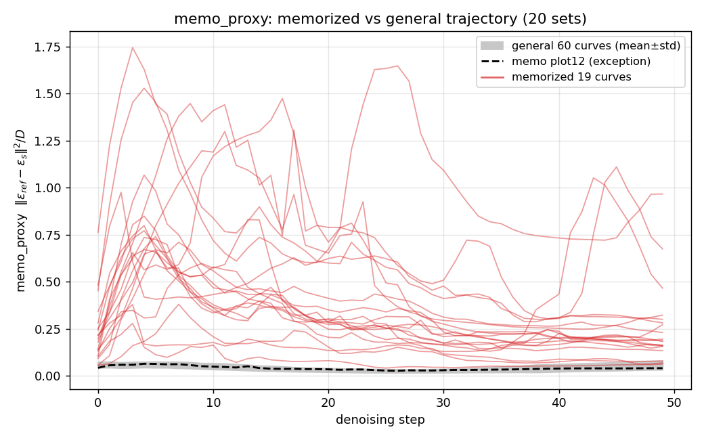

# memo_proxy(Tweedie domain gap) 판별력 평가 — 개형 기준 (2026-08-22)

## 판정: **GOOD**

좋은 proxy의 정의(3 general + 1 memorized 곡선 개형 비교, 자동 감지) 적용 결과:

- **20개 비교셋 중 19개에서 memorized 곡선이 뚜렷이 분리**
- memo 곡선이 text 3개의 최대 곡선 위에 있는 step 비율 **평균 94%**
- memo/text 평균 비율: 전형적으로 **5~20x** (최대 25.6x)
- 예외: plot12 (비율 1.06x, 20%) — 이 셋의 memo 프롬pt는 분리 없음

## 데이터

- 측정: `results_eps_trajectory/ddim/CFG=7.5_NFE=50/seed=42/batch=5/plot00-19` **기존 결과 재사용**
  (생성: `run_eps_trajectory.sh`, MEASURE=memo_proxy)
- 모델: vanilla SD1.4, CFG=7.5, NFE=50, seed=42, batch=5 (seed 평균 곡선)
- 구성: plot당 coco_v2 3개 (general) + memorized_prompts_membench 1개 (memorized)
- 곡선: `csv/proxy_00~02.csv` = text, `csv/proxy_03.csv` = memo (npz prompt 필드로 신원 확인)

## 곡선 개형

*General 60곡선(회색 밴드, mean±std) 대비 memorized 20곡선 — 적색 19곡선이 밴드 위로
명확히 분리, 점선(plot12)만 예외*

- text 3곡선: mean ≈ 0.03–0.06으로 낮게 밀집, 서로 유사한 개형
- memo 곡선: 초기 step부터 3~5배 높게 출발 (예: plot00 step0 0.197 vs text 0.068–0.077),
  이후 격차 유지·확대 — "memo_proxy가 클수록 x_t에서 추정한 x̂₀의 tweedie domain gap이 크다"는
  registry 해석과 부합

## plot별 수치

| plot | memo_mean | text_mean | mean_ratio | memo>text_max 비율 |
|---|---|---|---|---|
| plot00 | 0.7851 | 0.0510 | 15.4x | 100% |
| plot01 | 0.6416 | 0.0391 | 16.4x | 100% |
| plot02 | 0.0817 | 0.0358 | 2.3x | 92% |
| plot03 | 0.1399 | 0.0384 | 3.6x | 94% |
| plot04 | 0.3111 | 0.0466 | 6.7x | 100% |
| plot05 | 0.8047 | 0.0461 | 17.5x | 100% |
| plot06 | 0.2969 | 0.0503 | 5.9x | 100% |
| plot07 | 0.5797 | 0.0363 | 16.0x | 100% |
| plot08 | 0.3180 | 0.0396 | 8.0x | 100% |
| plot09 | 0.6096 | 0.0311 | 19.6x | 100% |
| plot10 | 0.1380 | 0.0435 | 3.2x | 78% |
| plot11 | 0.2930 | 0.0400 | 7.3x | 100% |
| plot12 | 0.0401 | 0.0379 | **1.06x** | **20%** |
| plot13 | 0.3076 | 0.0578 | 5.3x | 100% |
| plot14 | 0.2704 | 0.0316 | 8.6x | 100% |
| plot15 | 0.3887 | 0.0376 | 10.4x | 100% |
| plot16 | 0.2833 | 0.0448 | 6.3x | 98% |
| plot17 | 0.3161 | 0.0379 | 8.4x | 100% |
| plot18 | 0.3765 | 0.0524 | 7.2x | 100% |
| plot19 | 0.6597 | 0.0257 | 25.6x | 100% |

## 자동 해석

- **memo_proxy는 memorization을 inference-time에서 감지할 수 있다** — memorized 곡선의
  개형이 general 3개와 유달리 다름이 19/20셋에서 자동 감지됨 (새 기준표의 GOOD 조건)
- 동일 모델·CFG에서 block_energy는 REJECT(곡선 완전 중첩), memo_proxy는 GOOD —
  **proxy 선택이 판별력을 결정**하며 방향 1의 우위를 방향 2 대비 입증
- plot12 예외: 해당 memo 프롬pt의 memorization이 약하거나 다른 개형일 가능성.
  프롬pt별 감지 강도와 실제 memorization 강도(SSCD)의 상관은 후속 확인 가치 있음

## 한계

- 개형 차이의 정량 기준은 "memo > text 최대곡선인 step 비율"로 임시 정의 — 스킬 TODO
  명문화 필요 (임계값, 초기/후반 구간 가중 등)
- memorized 소스가 membench(wen2024 아님), seed 평균 곡선, n=20셋
- SSCD-to-GT 대비 연속 상관(강도 정합성)은 미측정 — 판정은 개형 분리(감지 가능성)에 한정

## 다음 액션

1. plot12 예외 프롬pt 확인 — 약기억 프롬pt에서의 한계 탐색 (프롬pt별 강도 tagging)
2. 개형 감지 기준 명문화 → proxy-check SKILL.md TODO 해소 (`scripts/evaluate_shape.py` 초안 확보)
3. GOOD 판정을 받은 memo_proxy를 완화 loss로 사용하는 `run_ini_opti` sweep 연결 (/tune)
